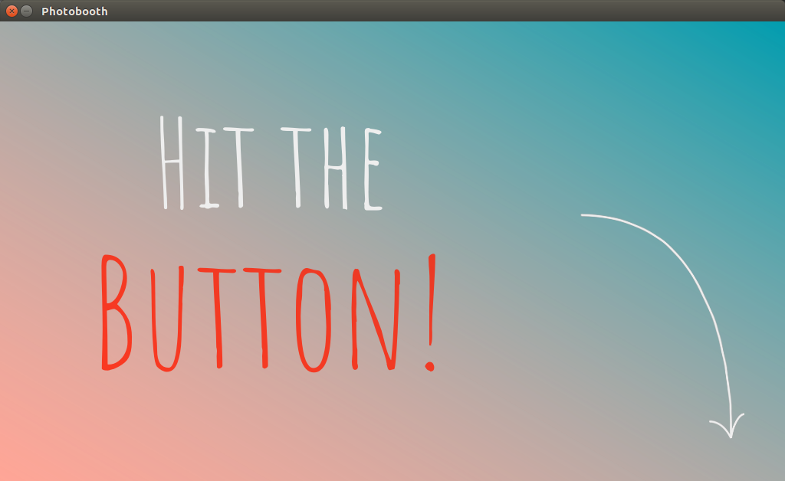
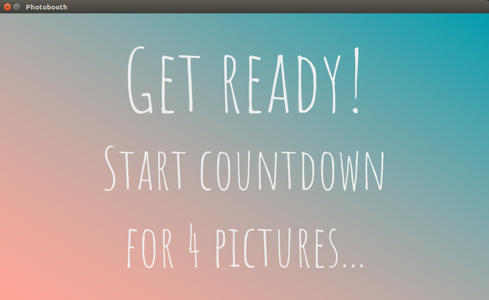
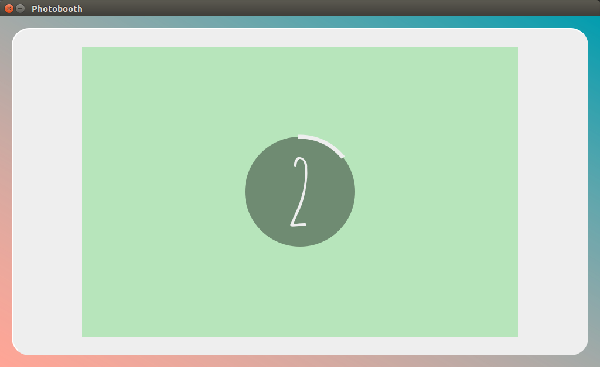
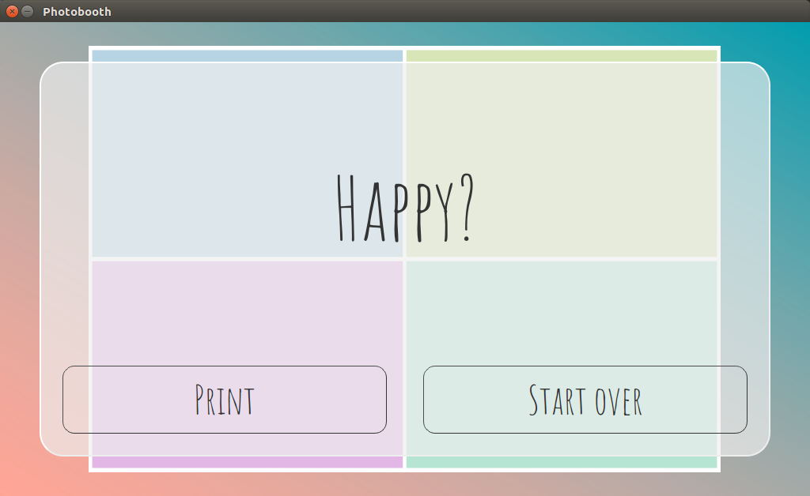
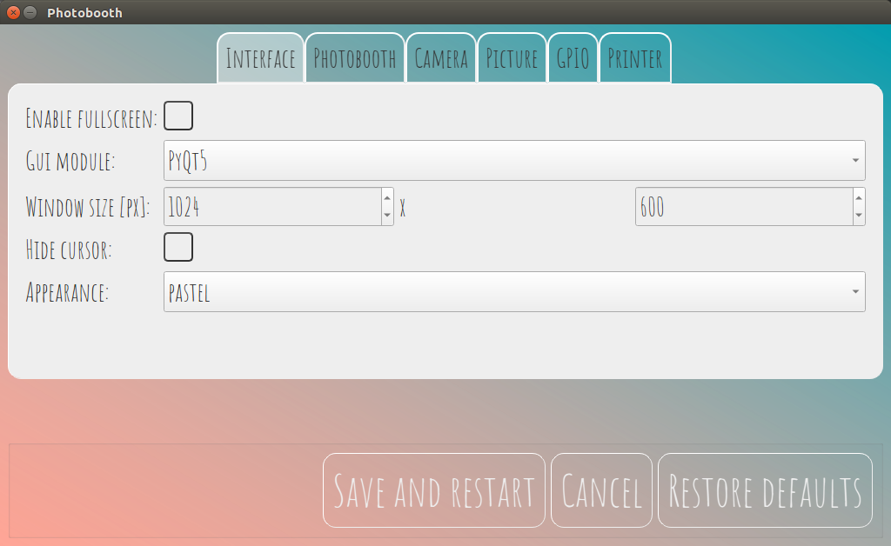
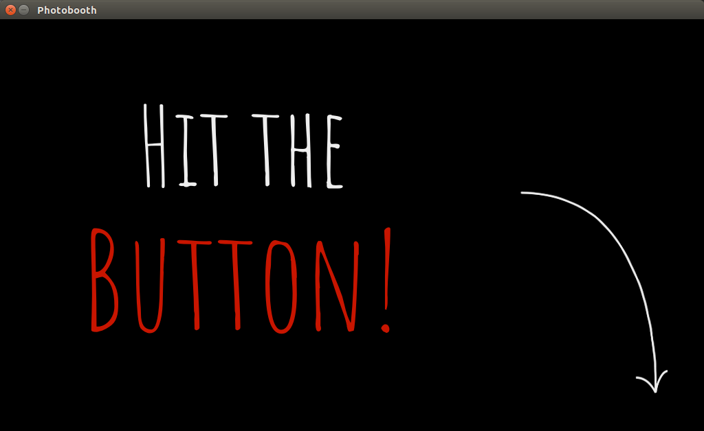
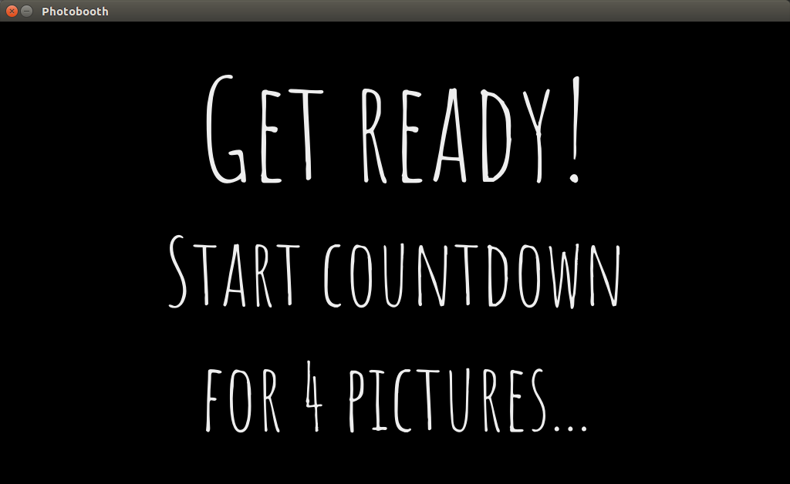
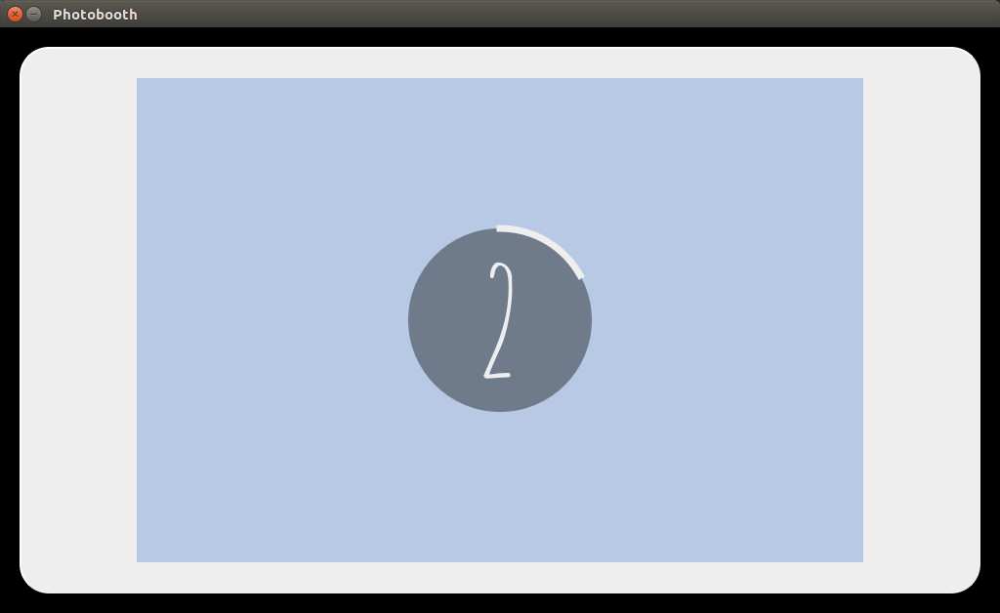
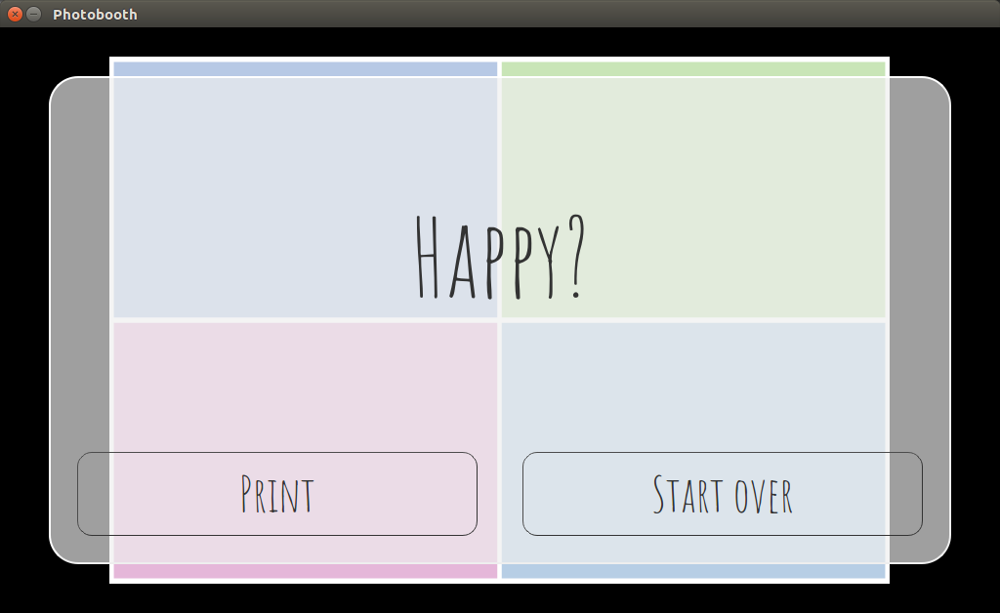

# photobooth

A flexible Photobooth software.

It supports many different camera models, the appearance can be adapted to your likings, and it runs on many different hardware setups.

## Description
This is a Python application to build your own photobooth.

### Features
* Capture a single or multiple pictures and assemble them in an m-by-n grid layout
* Live preview during countdown
* Printing of captured pictures
* Highly customizable via settings menu inside the graphical user interface
* Support for external buttons and lamps via GPIO interface
* Theming support using [Qt stylesheets](https://doc.qt.io/qt-5/stylesheet-syntax.html)

### Screenshots
Screenshots produced using `CameraDummy` that produces unicolor images.

#### Theme _pastel_
    

#### Theme _dark_
   

### Technical specifications
* Many camera models supported, thanks to interfaces to [gPhoto2](http://www.gphoto.org/), [OpenCV](https://opencv.org/),  [Raspberry Pi camera module](https://projects.raspberrypi.org/en/projects/getting-started-with-picamera)
* Tested on Standard x86 hardware and [Raspberry Pi](https://raspberrypi.org/) models 1B+, 2B, 3B, and 3B+
* Flexible, modular design: Easy to add features or customize the appearance
* Multi-threaded for responsive GUI and fast processing
* Based on [Python 3](https://www.python.org/), [Pillow](https://pillow.readthedocs.io), and [Qt5](https://www.qt.io/developers/)

### History
I started this project for my own wedding in 2015. 
See [Version 0.1](https://github.com/reuterbal/photobooth/tree/v0.1) for the original version.
Github user [hackerb9](https://github.com/hackerb9/photobooth) forked this version and added a print functionality.
However, I was not happy with the original software design and the limited options provided by the previously used [pygame](https://www.pygame.org) GUI library and thus abandoned the original version.
Since then it underwent a complete rewrite, with vastly improved performance and a much more modular and mature software design.

## Installation and usage

### Hardware requirements
* Some computer/SoC that is able to run Python 3.5+ as well as any of the supported camera libraries
* Camera supported by gPhoto 2 (see [compatibility list](http://gphoto.org/doc/remote/)), OpenCV (e.g., most standard webcams), or a Raspberry Pi Camera Module.
* Optional: External buttons and lamps (in combination with GPIO-enabled hardware)

### Installing and running the photobooth

See [installation instructions](INSTALL.md).

## Configuration and modifications
Default settings are stored in [`defaults.cfg`](photobooth/defaults.cfg) and can either be changed in the graphical user interface or by creating a file `photobooth.cfg` in the top folder and overwriting your settings there.

The software design is very modular.
Feel free to add new postprocessing components, a GUI based on some other library, etc.

## Feedback and bugs
I appreciate any feedback or bug reports.
Please submit them via the [Issue tracker](https://github.com/reuterbal/photobooth/issues/new?template=bug_report.md) and always include your `photobooth.log` file (is created automatically in the top folder) and a description of your hardware and software setup.

I am also happy to hear any success stories! Feel free to [submit them here](https://github.com/reuterbal/photobooth/issues/new?template=success-story.md)

If you find this application useful, please consider [buying me a coffee](https://www.buymeacoffee.com/reuterbal).

## License
I provide this code under AGPL v3. See [LICENSE](https://github.com/reuterbal/photobooth/blob/master/LICENSE.txt).
